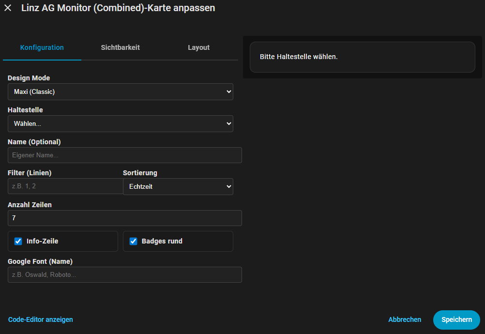
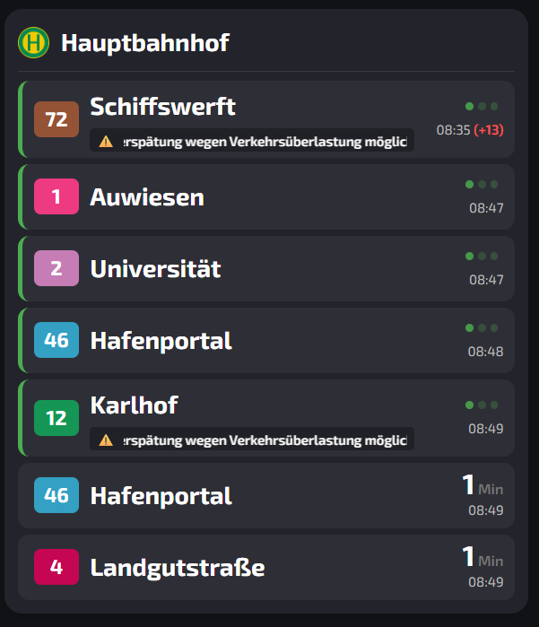
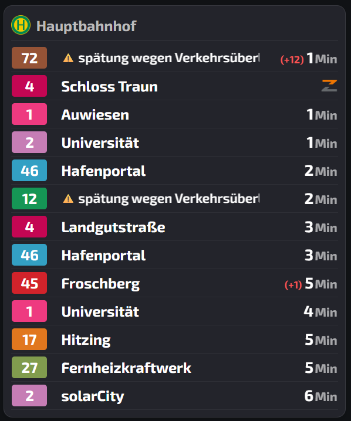
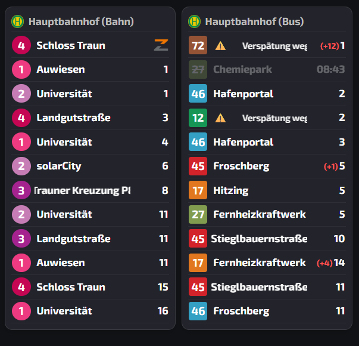

# Linz Linien Card

Linz AG Monitor — Combined Lovelace Card (V1 / V2 / V3)  
Eine einzige benutzerdefinierte Lovelace‑Karte, die drei Layout‑Varianten (Maxi / Midi / Mini) als konfigurierbare Unterversionen vereint.

Kurz: Sie benötigen nur dieses eine Repository / diese eine Resource, um alle drei Monitor‑Varianten nutzen zu können. 🚆

---

## Features
- Alle drei Varianten in einer Karte: `v1` (Maxi), `v2` (Midi), `v3` (Mini) ✅  
- Pro‑Version eigene Einstellungen (jeweils `v1`, `v2`, `v3`) — bequem in einem Config‑Objekt steuerbar 🔁  
- Filter, Sortierung (Echtzeit / Plan), Badge‑Stile, Lauftexte, Auto‑Scroll und mehr ✨

---

## Screenshots

- Einstellungen / Übersicht (Combined editor & Optionen):



- Darstellung V1 (Maxi):



- Darstellung V2 (Midi):



- Darstellung V3 (Mini):



---

## Installieren

### 1) Über HACS (empfohlen)
1. HACS → Einstellungen → Custom repositories → Repository URL:  
   `https://github.com/irmscher123/linz-linien-card`  
   Kategorie: `Lovelace`  
2. HACS → Frontend → „Linz Linien Card“ installieren.

> Hinweis: `hacs.json` ist im Repo vorhanden, damit HACS das Repository richtig erkennt. Erstellen Sie einen Release (Tag), z. B. `v1.0.0`, für eine saubere Versionierung.

### 2) Manuell
1. Datei `linz-monitor-combined.js` nach `/config/www/` hochladen.  
2. Lovelace → Einstellungen → Ressourcen → Ressource hinzufügen: `/local/linz-monitor-combined.js` (Typ: JavaScript module).  
3. Lovelace Cache leeren (Strg+F5).

---

## Verwendung / Beispielkonfiguration

Minimal (V2 Beispiel):
```yaml
type: custom:linz-monitor-card
version: v2
v2:
  entity: sensor.linz_ag_monitor
  anzahl: 8
  row_height: 38
  font_size: 20
  dest_size: 18
  filter: "1,2"
  sortierung: "echtzeit"
