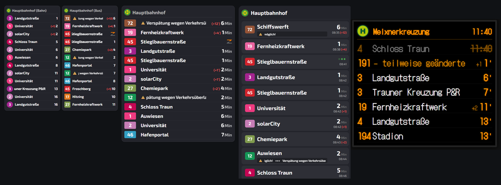

# 🚋 Linz Linien Abfahrtsmonitor

[](https://github.com/hacs/integration)
[]()
[]()




**Der moderne Abfahrtsmonitor für Home Assistant.**  
Live‑Daten der Linz AG Linien, einfache Einrichtung und ansprechende Dashboard‑Karten.

---

## ✨ Features

- ⚡ Echtzeit‑Daten (Linz AG)  
- 🔍 Smart Search für Haltestellen (kein Suchen nach kryptischen IDs)
- ℹ️ Linien/Richtungen/Ziele Auswählbar
- 🎨 Vier Design‑Varianten: Mini (v3), Midi (v2), Maxi (v1), LED Wall — jetzt in einer einzigen Karte zusammengeführt  
- 📱 Responsive: Tablets & Smartphones  
- ⚙️ UI‑Konfiguration via Lovelace Editor

---

## ⚙️ Einrichtung — 1) Sensor hinzufügen (wichtig: zuerst) 🚦

Bevor Sie Dashboard‑Karten nutzen, fügen Sie bitte zunächst die Integration hinzu und erzeugen den Sensor mit departureList‑Attributen.

1. Gehen Sie zu **Einstellungen** > **Geräte & Dienste** > **Integration hinzufügen**.  
2. Suchen Sie nach **Linz Linien Abfahrtsmonitor**.  
3. Geben Sie den Namen der Haltestelle ein (z. B. `Simonystraße`).  
4. Wählen Sie den korrekten Treffer aus der Liste.  
5. Fertig — Sie haben nun einen Sensor (z. B. `sensor.simonystrasse`), den Sie in den Dashboard‑Karten auswählen.

> Hinweis: Falls Sie die Karte ohne Sensor hinzufügen, zeigt sie keine Abfahrten an — daher zuerst Integration/Sensor anlegen.

---

## 📥 Dashboard‑Karten (separates Repo) 🗂️

Wichtig: Die Dashboard‑Karten (UI/JS‑Dateien) werden in einem separaten Repository verwaltet:  
https://github.com/irmscher123/linz-linien-card

Warum?
- Saubere Trennung: Diese Repository (linz-linien-abfahrtsmonitor) enthält die Integration (backend),  
  während UI‑/Dashboard‑Karten (Frontend/JS) zentral in einem eigenen Repo gepflegt werden.

Wo finde ich die Karten?
- Repository: https://github.com/irmscher123/linz-linien-card  
- Empfohlener Pfad (Beispiel): `dashboard-cards/linz-monitor-combined.js`  
- Raw‑Link (Beispiel): `https://raw.githubusercontent.com/irmscher123/linz-linien-card/main/dashboard-cards/linz-monitor-combined.js`

Installationsmöglichkeiten für die Dashboard‑Karten
- Option 1 — HACS (empfohlen für Nutzer):  
  - Fügen Sie das UI‑Repo als Custom Repository in HACS hinzu: `https://github.com/irmscher123/linz-linien-card` (Kategorie: Lovelace / Frontend).  
  - Installieren Sie die Karte via HACS → Frontend. HACS fügt meist automatisch die Ressource hinzu.  
- Option 2 — Manuell (Download Raw):  
  - Laden Sie `linz-monitor-combined.js` aus `https://raw.githubusercontent.com/irmscher123/linz-linien-card/main/linz-monitor-combined.js` herunter.  
  - Speichern Sie die Datei in `/config/www/` Ihrer Home Assistant‑Installation.  
  - In Lovelace → Einstellungen → Dashboards → Ressourcen → Ressource hinzufügen: URL `/local/linz-monitor-combined.js`, Typ: JavaScript Module.  
- Option 3 — Git Submodule (für Maintainer):  
  - Wenn Sie möchten, können Sie das UI‑Repo als Submodule in dieses Repo einbinden:
    ```bash
    git submodule add https://github.com/irmscher123/linz-linien-card dashboard-cards
    git commit -m "Add dashboard-cards submodule"
    ```
  - Vorteil: hält UI‑Code synchron, erspart manuellen Download.

Migration (wenn vorher separate V1/V2/V3 lokal genutzt wurden)
1. Entfernen Sie alte Ressourcen in Lovelace:
   - `/local/linz-monitor-card_v1.js`  
   - `/local/linz-monitor-card_v2.js`  
   - `/local/linz-monitor-card_v3.js`
2. Installieren Sie stattdessen die kombinierte Datei `linz-monitor-combined.js` (siehe oben).  
3. Optional: Alte Dateien archivieren in `deprecated/` (im Repo oder `/config/www/deprecated/`) — nicht parallel laden.

---

## 🖼️ Vorschau

| Design V1 (Maxi) | Design V2 (Midi) | Design V3 (Mini) | LED Wall  |
| :---: | :---: | :---: | :---: |
|  |  |  |  |

---

## ⚙️ Verwendung & Konfiguration (Beispiele)

Eine Karte, drei Varianten — wählen Sie per `version`, welche Variante dargestellt wird.

Beispiel — Midi (v2):
```yaml
type: custom:linz-monitor-card
version: v2
v2:
  entity: sensor.haltestelle
  anzahl: 8
  row_height: 38
  font_size: 20
  dest_size: 18
  filter: "1,2"
  sortierung: "echtzeit"
